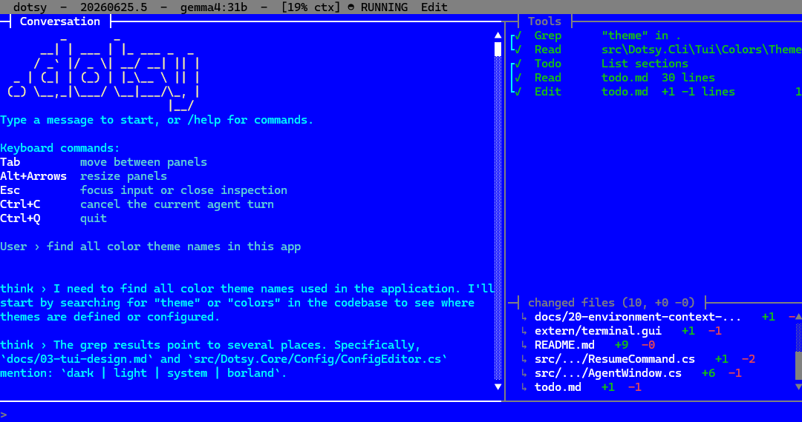

# Dotsy

[](https://github.com/loxsmoke/dotsy/actions/workflows/ci.yml)
[](https://github.com/loxsmoke/dotsy/actions/workflows/ci.yml)

```text
         _       _
      __| | ___ | |_ ___ _  _
     / _` |/ _ \| __/ __| || |
  _ | (_| | (_) | |_\__ \ || |
 (_) \__,_|\___/ \__|___/\_, |
                         |__/
```

Dotsy is an AI coding assistant written in C# and .NET. It provides a terminal-first agent experience with a TUI, multi-provider model support, MCP tooling, repository-aware code retrieval, session history, and headless command execution.

[](docs/screenshot.png)

## Specification

- [Agent specification](docs/00-spec-main.md)

## Build

Dotsy targets .NET 10 for the main CLI, core, provider, MCP, and test projects.

```powershell
dotnet restore Dotsy.slnx
dotnet build Dotsy.slnx -c Release
dotnet test Dotsy.slnx -c Release
```

### Build on macOS

Install the .NET 10 SDK, either with the [official installer](https://dotnet.microsoft.com/download/dotnet/10.0) or via Homebrew:

```bash
brew install --cask dotnet-sdk
```

Verify the SDK version, then restore, build, and test with the same commands:

```bash
dotnet --version
dotnet restore Dotsy.slnx
dotnet build Dotsy.slnx -c Release
dotnet test Dotsy.slnx -c Release
```

Packaging and tool installation also work on macOS — use forward slashes in paths:

```bash
dotnet pack src/Dotsy.Cli/Dotsy.Cli.csproj -c Release -v minimal --output artifacts/packages
dotnet tool uninstall --global dotsy
dotnet tool install --global dotsy --add-source artifacts/packages
```

If `dotsy` is not found after installing, make sure `~/.dotnet/tools` is on your `PATH`.

### Debug with Terminal.Gui source

This repository can build against Terminal.Gui source instead of the Terminal.Gui
NuGet package. The source checkout is expected at:

```text
extern\terminal.gui
```

The checkout is tracked as a git submodule and is pinned to the
`v2.0.0-develop.4376` Terminal.Gui tag because that source layout matches the
`Terminal.Gui` `2.0.0` NuGet package API that Dotsy currently targets.

Use the `Debug No Nugets` configuration when you want to step into Terminal.Gui
while developing Dotsy:

```powershell
dotnet build Dotsy.slnx -c "Debug No Nugets"
```

Normal builds and package builds keep using the Terminal.Gui NuGet package:

```powershell
dotnet build Dotsy.slnx -c Release
dotnet pack src\Dotsy.Cli\Dotsy.Cli.csproj -c Release /p:UseTerminalGuiSource=false
```

Do not publish Dotsy packages with `/p:UseTerminalGuiSource=true`; package
generation should use the Terminal.Gui NuGet dependency.

## Deploy

Package and install the CLI as a local .NET tool package:

```powershell
dotnet pack src\Dotsy.Cli\Dotsy.Cli.csproj -c Release -v minimal --output artifacts\packages
dotnet tool uninstall --global dotsy
dotnet tool install --global dotsy --add-source artifacts\packages
```

Run Dotsy with:

```powershell
dotsy
```
