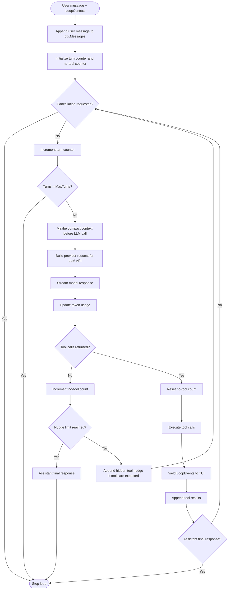

## 7. Agent Loop

### 7.1 Overview

The loop is an explicit `while` driven by `CancellationToken` and turn counter, modelled on **pi**'s `runLoop` with **cline**'s tool-nudge mechanism and **goose**'s mid-stream compaction recovery.

```csharp
public class AgentLoop
{
    // Returns an IAsyncEnumerable<LoopEvent> so the TUI can render in real time
    public IAsyncEnumerable<LoopEvent> RunAsync(
        string userMessage,
        LoopContext ctx,
        CancellationToken ct);
}
```



Step notes:

- **Append user message** adds the new user turn to `LoopContext.Messages`. It is also appended to the session log and rendered in the conversation panel, so it appears both in the visible chat and in the next provider request.
- **Cancellation requested** checks the `CancellationToken` passed into `RunAsync`. The source is external to the loop: TUI interrupt keys such as `Ctrl+C`, process shutdown, headless command cancellation, or any caller-owned cancellation source.
- **Initialize turn counter** sets `turns = 0` before entering the loop. **Increment turn counter** is only a loop guard, used to stop runaway sessions at `agent.max_turns`.
- **Maybe compact context** runs when token usage crosses `compaction.threshold_pct`, when the usable context is nearly exhausted, or after a provider context-length error. It summarises older messages, keeps recent messages verbatim, stores the summary on the context, and rebuilds the next request with that summary.
- **Build provider request** converts system prompt, compacted prior context, messages, and tool definitions into the provider payload sent to the LLM API.
- **Increment no-tool count** tracks consecutive model turns that returned text but no tool calls. It is used to detect a stalled agent when the loop expected tool progress.
- **Nudge limit** is the configured maximum number of consecutive no-tool turns before the loop stops nudging. A **nudge** is a hidden user-role instruction appended to the message list telling the model to either call an appropriate tool or give the final answer.
- **Assistant final response** is model-generated text from the LLM stream. It becomes final when the model returns no tool calls and the loop is allowed to stop for the current user turn, or when a completion signal such as the `done` tool is observed.

### 7.2 Loop Pseudocode

```
function RunLoop(userMessage, ctx, ct):
    turns = 0
    consecutiveNoTool = 0
    AppendUserMessage(ctx, userMessage)

    while not ct.IsCancellationRequested:
        turns++
        if turns > ctx.Config.MaxTurns:
            break

        // Context management before each LLM API call
        await MaybeCompact(ctx)

        // Build provider request for the configured LLM API
        request = BuildRequest(ctx)

        // Stream from provider
        (assistantMsg, toolCalls, usage) = await StreamResponse(request, ct)
        UpdateTokenUsage(ctx, usage)

        if toolCalls.IsEmpty:
            consecutiveNoTool++
            if consecutiveNoTool >= ctx.Config.NudgeLimit:
                break  // text-only assistant response is final for this turn
            AppendNudge(ctx)  // hidden instruction to use tools or finalise
            continue

        consecutiveNoTool = 0

        // Execute tools (parallel if configured and safe)
        results = await ExecuteTools(toolCalls, ctx, ct)

        // Check for completion signal
        if results.Any(r => r.IsCompletionSignal):
            break

        AppendToolResults(ctx, results)

        // Reflection: if linter/tests fail, inject error and retry
        if ctx.Config.ReflectOnErrors:
            error = await RunChecks(ctx)
            if error is not null and ctx.Reflections < ctx.Config.MaxReflections:
                ctx.Reflections++
                AppendReflection(ctx, error)
                continue

        ctx.Reflections = 0
```

### 7.3 Loop Events (yielded to TUI)

```csharp
public abstract record LoopEvent;
public record TextChunk(string Text)             : LoopEvent;
public record ThinkingChunk(string Text)         : LoopEvent;
public record ToolStarted(string Name, string Arg) : LoopEvent;
public record ToolFinished(string Name, ToolResult Result) : LoopEvent;
public record TurnComplete(int TotalTokens)      : LoopEvent;
public record CompactionOccurred(string Summary) : LoopEvent;
public record LoopEnded(EndReason Reason)        : LoopEvent;
```

### 7.4 Parallel Tool Execution

When the model returns multiple tool calls in one response, tools that are read-only (read, glob, grep, webfetch) are executed concurrently via `Task.WhenAll`. Write operations (write, edit, bash) are executed sequentially to avoid conflicts. Each tool declares `ToolSafety { ReadOnly | Sequential }`.

### 7.5 Reflection Loop

After applying file edits, if `auto_lint` or `auto_test` is configured, the loop runs the configured command and captures output. On failure (non-zero exit or error output), it appends the failure as a user message and re-enters the loop (up to `max_reflections = 3`, same as **aider**). This lets the agent self-correct syntax errors without user intervention.

---

